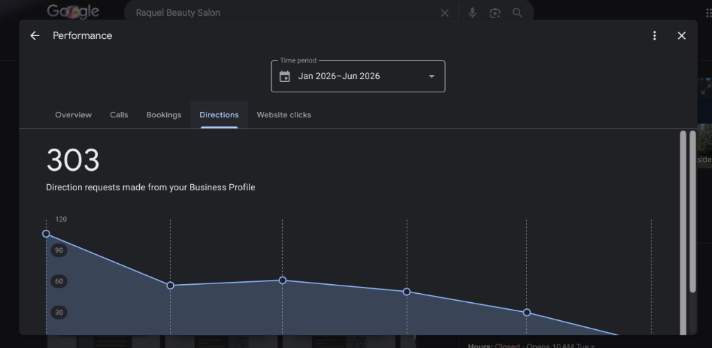
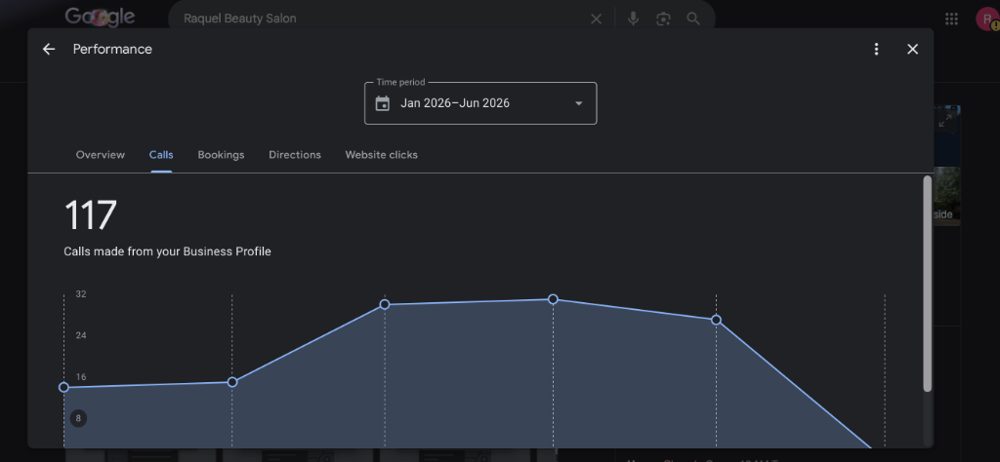

# Google Business Profile Performance Analysis (Jan 2026 – Jun 2026)

This report analyzes the performance metrics for **Raquel's Beauty Salon**'s Google Business Profile (GBP) over the six-month period from January 2026 to June 2026.

---

## 📈 Executive Summary

* **Total Interactions:** **420** Business Profile interactions.
  * **Direction Requests:** **303** (72.1% of total interactions) - The primary driver of profile activity.
  * **Phone Calls:** **117** (27.9% of total interactions) - Direct lead/booking channel.
  * **Website Clicks & Bookings:** **0** - High growth opportunity (due to the lack of a website link previously).
* **Overall Trend:** High navigation and intent activity in January, followed by stable phone calling activity peaking in March/April, and a general seasonal decline as summer approaches.

---

## 📊 Monthly Metrics & Trends Breakdown

### 🚗 Direction Requests (303 Total)
* **Trend:** High peak in January (~110 requests), dropping to a stable baseline of ~50-60 requests from February through April, and sliding to ~30 in May.
* **Analysis:** Direction requests represent high-intent foot traffic or driving clients. The high baseline shows strong repeat customer patterns and local search discovery.
* **Graphic:** 

### 📞 Phone Calls (117 Total)
* **Trend:** Remained low in January/February (~12-13 calls/month) but doubled in March (~29 calls) and April (~30 calls), remaining strong in May (~27 calls).
* **Analysis:** While direction requests dropped in spring, actual booking calls doubled. This shows that clients who already knew the route (fewer direction requests) were calling in regularly for spring trims and treatments.
* **Graphic:** 

---

## 🔍 Key Insights & Action Plan

To reverse the summer slowdown and grow interactions beyond the 120/month peak:

### 1. Leverage the New Website Link
* **Impact:** Previously, the profile did not point to a dedicated landing page. Adding the new link will turn standard impressions into **Website Clicks**.
* **Action:** Embed the GitHub Pages URL in the primary GBP website field to start capturing clicks and boosting search authority.

### 2. Focus on the Men's Haircut Specialty (Barber Shop Category)
* **Impact:** "Barber Shop" is a highly searched local keyword. Aligning her profile with this category (and adding services like classic fades and beard trims) will capture men's regular monthly grooming cycles.
* **Action:** Highlight these services clearly on the profile and upload the new high-resolution client haircut photos regularly.

### 3. Review Response Strategy
* **Impact:** Google favors profiles that actively engage with reviews.
* **Action:** Share the short review link with all weekly clients, and reply to all incoming reviews in English and Spanish to build community trust and local search relevance.

---

## 📅 Baseline Reference & Future Tracking

* **Website Launch Date:** **June 2, 2026** (Today)
* **Performance Baseline:** All metrics prior to today (January – June 2026) establish our pre-website baseline.
* **Tracking Plan:** Starting today, we will monitor Google Business Profile metrics onwards to measure how the newly launched website affects salon growth—focusing specifically on the emergence of **Website Clicks**, growth in monthly **Phone Calls**, and overall local visibility.

---

*Report generated on June 2, 2026, for Raquel's Beauty Salon.*
